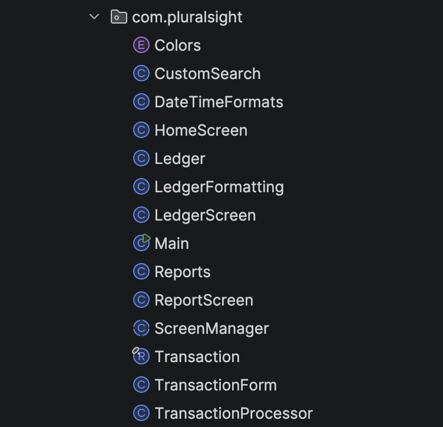

<h1 align="center">📊 LedgerFlow</h1>

<p align="center">
  Console-Based Financial Ledger System built with Java
</p>

## 🧐 About The Project

#### LedgerFlow is a Java-based console application that allows users to record, manage, and analyze financial transactions.

#### The application simulates a real-world ledger system where users can:
* Record deposits and payments
* View transaction history
* Filter transactions using predefined and custom reports


#### This project focuses on clean architecture, file persistence, and advanced Java concepts like streams and predicates.

---

## ⚙️ Features 
### 1. 💰 Transaction Management
    * Add depsoits
    * Manual input for date and time (ledger-style tracking)
    * Saving transactions to a CSV file
### 2. 📒 Ledger View
    * Displays all transactions in a structured, formatted table
    * Uses ANSI colors for better readablity
### 3. 📝 Reports System 
    * Month-to-Date
    * Previous Month
    * Year-to-Date
    * Previous year
### 🔍 Custom Search
    * Users can filter transactions by:
        * Start Date
        * End Date
        * Description
        * Vendor
        * Amount

---

## 💻 Tech Stack
#### Language: Java
#### Concepts Used:
* Object-Oriented Programming
* Loops
* Switch cases
* List/ArrayLists
* Predicate
* Record
* Streams
* Lambda Expressions
* Thread
* File I/O (BufferedReader / BufferedWriter)
* Date & Time API (LocalDate, LocalTime, DateTimeFormatter)
* Enum (Colors)

---

## 🚧 Biggest Challenge
A challenge I faced was making the console output clean and readable. I wanted the ledger to look structured and professional,
so I had to experiment with spacing, formatting, and ANSI escape codes for colors. Getting everything aligned properly, especially
when working with dynamic data, took trial and error, but it helped improve the overall user experience.

---

#### This snippet of code is what I'm the most proud of because I implemented dynamic filtering using Java Streams. Instead of writing multiple conditional branches, I designed the logic so each filter only applies if the user provides input.
```java
        List<Transaction> transactions = transactionList.stream()

                // Include transactions on or after the start date, if provided.
                .filter(t -> startDate == null || !t.transactionDate().isBefore(startDate))

                // Include transactions on or before the end date, if provided.
                .filter(t -> endDate == null || !t.transactionDate().isAfter(endDate))

                // Match description partially and case-insensitively, if provided.
                .filter(t -> description == null || description.isBlank() ||
                        t.transactionDescription().toLowerCase().contains(description.toLowerCase()))

                // Match vendor partially and case-insensitively, if provided.
                .filter(t -> vendor == null || vendor.isBlank() ||
                        t.vendor().toLowerCase().contains(vendor.toLowerCase()))

                // Compare doubles using a small tolerance instead of exact equality.
                .filter(t -> amount == null || Math.abs(t.transactionAmount() - amount) < 0.01)
                .toList();
```

---

## 📂 Project Structure


---

## 🚀 Getting Started

To run this project locally, you'll need the following: 

- Java JDK 17 or higher
- An IDE (IntelliJ preferably)
- Git installed (Can also just copy and paste the code directly)

Make sure Java is properly installed by running: 
```bash
java -version
```

---

## 🛠️ Installation

1. Clone the repository:
`git clone` https://github.com/nathanwondim16-lab/ledger-flow.git`

2. Navigate into the project folder: 
   * "cd ledger-flow"
3. Open the project in IntelliJ or your preferred IDE
4. Make sure your project SDK is set to Java 17+
5. Locate and run the main class:
   * `HomeScreen.java`